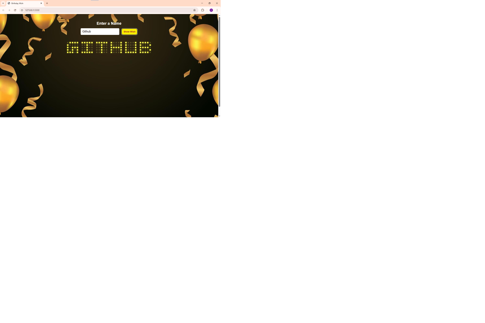

# 🎉 birthday-wish

## ✨ Birthday Name Glow — A Unique Way to Light Up Someone's Name!

Celebrate birthdays (or any special day) with a fun, digital twist! This project takes a simple name and lights it up—literally—using glowing, animated boxes. It's a minimalist, attention-grabbing webpage you can share with friends, family, or even yourself to make someone feel a little more special.

---

## 💡 What Can You Use It For?

🎁 Surprise your friend with their name lit up in a cool design  
🎂 Share a personalized link on birthdays  
💖 Wish yourself in style—you deserve it too!  
📸 Capture aesthetic screenshots for stories or posts  
✏️ Customize it easily for anniversaries, shout-outs, or motivational quotes  

---

## ⚙️ Features

- 🌟 Glowing animated boxes for each character  
- ⌨️ Type any name or word — instantly displayed  
- 🎨 Fully customizable colors and layout  
- 🌐 Works right in the browser — no installation needed  

---

## 🚀 How to Use

1. Clone this repository or [download the ZIP](https://github.com/anshika0704/birthday-wish/archive/refs/heads/main.zip)
2. Open `index.html` in any modern browser
3. Type a name — and enjoy the glow!

---

## 🧱 Built With

- HTML
- CSS (pure, no frameworks)
- JavaScript (vanilla)

---

## 📸 Preview

  

---

## 📄 License

This project is licensed under the **MIT License** — feel free to use, modify, and share it!

---

## 🤝 Contributing

Pull requests are welcome!  
If you have suggestions for improvements or want to add more customization features, feel free to open an issue or fork the repo.

---

Made with ❤️ to help spread joy!
